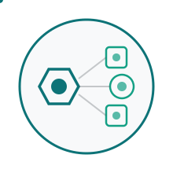

# Outboxx

<picture>
  <source media="(prefers-color-scheme: dark)" srcset="logo/dark/logo-animated-icon-only.svg">
  <source media="(prefers-color-scheme: light)" srcset="logo/light/logo-animated-icon-only.svg">
  
</picture>

**PostgreSQL Change Data Capture in Zig**

Lightweight tool that streams WAL changes to Kafka. Built in Zig for minimal resource consumption.

**🚀 Development Status**: Core CDC pipeline implemented with streaming replication. Under active optimization, approaching alpha release.

## What is Outboxx?

Outboxx captures PostgreSQL database changes in real-time and streams them to Kafka topics. Inspired by Debezium but designed for simplicity and low resource usage.

**Key Features:**
- PostgreSQL streaming replication (pgoutput) ✅
- Multi-table CDC streams ✅
- Kafka producer integration ✅
- TOML-based configuration ✅
- Memory-safe Zig implementation ✅

## Current vs Planned

| Component | Status |
|-----------|--------|
| PostgreSQL Streaming Replication | ✅ Working |
| Message Processing | ✅ Working |
| Kafka Producer | ✅ Working |
| TOML Configuration | ✅ Working |
| Multi-stream Support | ✅ Working |
| Schema Registry | 📋 Planned |
| Table/Column Filtering | 📋 Planned |
| Production Features | 📋 Planned |

## Inspired by Debezium

Outboxx is heavily inspired by [Debezium](https://debezium.io/), the industry standard for Change Data Capture. Debezium is an excellent, battle-tested solution with a rich feature set. However, being a JVM-based application, it comes with resource overhead that may not be suitable for all environments:

| Aspect | Outboxx | Debezium |
|--------|---------|----------|
| **Runtime** | Native binary | JVM (Kafka Connect) |
| **Memory Usage** | <10 MB | ~200-500 MB |
| **Startup Time** | <1s | 10-30s |
| **Configuration** | Simple TOML | Complex JSON/Properties |
| **Deployment** | Single binary | Kafka Connect cluster |

**Choose Outboxx when:**
- Memory is constrained (containers, edge computing, cost optimization)
- Simple deployment without Kafka Connect infrastructure
- Learning Zig or experimenting with lightweight CDC solutions
- Native binary and minimal dependencies preferred

**Stick with Debezium when:**
- Production-critical workloads requiring mature, battle-tested solution
- Complex transformations and extensive connector ecosystem needed
- Kafka Connect infrastructure already in place
- Enterprise support and maximum feature coverage required

Outboxx aims to bring Debezium's excellent CDC concepts to resource-constrained environments where every MB of RAM matters.

## Configuration Example

```toml
[metadata]
version = "v0"

[source]
type = "postgres"

[source.postgres]
host = "localhost"
port = 5432
database = "mydb"
user = "postgres"
password_env = "POSTGRES_PASSWORD"
slot_name = "outboxx_slot"
publication_name = "outboxx_publication"

[sink]
type = "kafka"

[sink.kafka]
brokers = ["localhost:9092"]

# Multiple streams for different tables
[[streams]]
name = "users-stream"

[streams.source]
resource = "users"
operations = ["insert", "update", "delete"]

[streams.flow]
format = "json"

[streams.sink]
destination = "user_changes"

[[streams]]
name = "orders-stream"

[streams.source]
resource = "orders"
operations = ["insert", "update"]

[streams.flow]
format = "json"

[streams.sink]
destination = "order_changes"
```

For complete configuration examples and architectural documentation, see [`docs/examples/config.toml`](docs/examples/config.toml).

## Quick Start

### 1. Prerequisites

**PostgreSQL Requirements**: Version 14 or later (tested and supported versions)

**Configure PostgreSQL** (`postgresql.conf`):
```ini
wal_level = logical              # Required for logical replication (CDC)
```

Restart PostgreSQL after configuration changes.

**Create User** (run as PostgreSQL superuser):

```sql
-- Create user with REPLICATION attribute (required for replication slots and WAL access)
CREATE USER outboxx_user WITH REPLICATION PASSWORD 'secure_password';

-- Grant database access
GRANT CONNECT ON DATABASE my_database TO outboxx_user;

-- Grant schema access (CREATE needed for creating publications)
GRANT USAGE, CREATE ON SCHEMA public TO outboxx_user;

-- Grant table access (SELECT needed for logical replication)
GRANT SELECT ON TABLE my_table TO outboxx_user;

-- Enable REPLICA IDENTITY FULL (required for capturing complete row data in UPDATE/DELETE)
ALTER TABLE my_table REPLICA IDENTITY FULL;
```

**Note**: Outboxx automatically creates replication slot and publication on startup. Currently supports `public` schema only.

**Kafka Setup**:
- Topics are auto-created by default (`auto.create.topics.enable=true`)
- For production: pre-create topics with desired partitions and replication factor
- Outboxx will fail-fast if topic doesn't exist and auto-create is disabled

### 2. Running Outboxx

```bash
# Build the application
make build

# Run with your configuration
export POSTGRES_PASSWORD="your_password"
./zig-out/bin/outboxx --config config.toml
```

### 3. Production Deployment

⚠️ **Outboxx requires a process supervisor** (systemd, Kubernetes, Docker restart policy, supervisord) as it uses fail-fast error handling. PostgreSQL replication slots preserve state across restarts.

## Contributing

This is a learning project for Zig programming. See [`dev/README.md`](dev/README.md) for development setup.

### Architecture Documentation

For complete configuration examples and design vision, see [`docs/examples/`](docs/examples/).

## License

MIT License - See LICENSE file for details.
